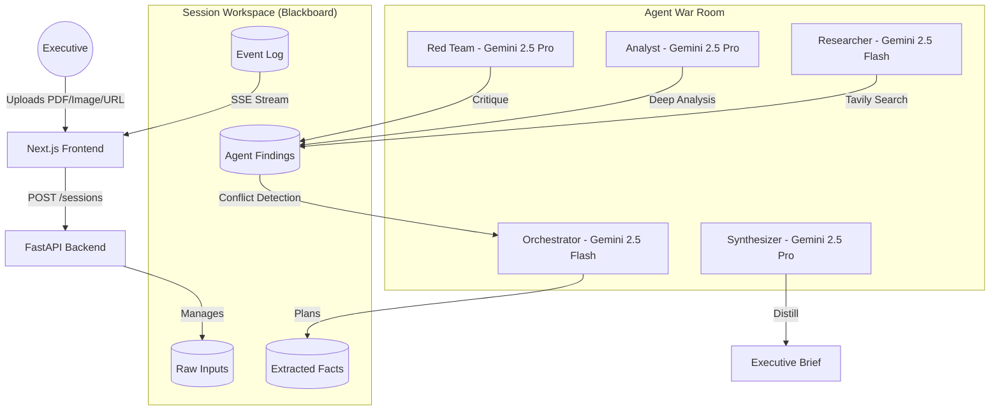

# Boardroom Architecture

Boardroom follows a **Blackboard Architecture** pattern, optimized for multi-agent collaboration and real-time executive decision support.

## System Overview

## Workflow Detail

1.  **Input Processing:**
    *   **PDFs:** Parsed via PyMuPDF.
    *   **Images:** Analyzed via Gemini Vision to extract whiteboard notes.
    *   **URLs:** Content extracted via Trafilatura.
2.  **Orchestration:**
    *   The **Orchestrator** reads all raw inputs and distills them into a "Facts" list on the Blackboard.
    *   It then triggers the **Researcher** and **Analyst** in parallel using `asyncio.gather`.
3.  **Adversarial Loop:**
    *   Once the initial analysis is complete, the **Red Team** is triggered. Its specific mission is to find "disconfirming evidence" and challenge the Analyst's assumptions.
4.  **Conflict Detection:**
    *   The Orchestrator performs a secondary pass to compare the Analyst and Red Team outputs. If a material contradiction is found, a `⚡ Conflict detected` event is emitted.
5.  **Synthesis:**
    *   The **Synthesizer** reads the entire Blackboard (Inputs + Research + Analysis + Critique + Conflicts) and produces a structured JSON brief.

## Data Flow (Real-time)

Boardroom uses **Server-Sent Events (SSE)** to provide a "live" feel:
*   As agents "think" or call tools, they push events to an `asyncio.Queue`.
*   The `/stream` endpoint drains this queue and pushes tokens to the frontend.
*   The frontend renders each agent in its own panel, providing a visual representation of the "War Room" in action.

## Hardening Features

*   **Demo Mode:** A query-param toggle (`?demo=true`) that bypasses the backend and uses `mock-data.ts` for a bulletproof presentation.
*   **Health Checks:** The UI monitors backend availability and provides immediate feedback.
*   **Stand-alone Deployment:** Frontend is optimized for Vercel, while the backend is Docker-ready.
